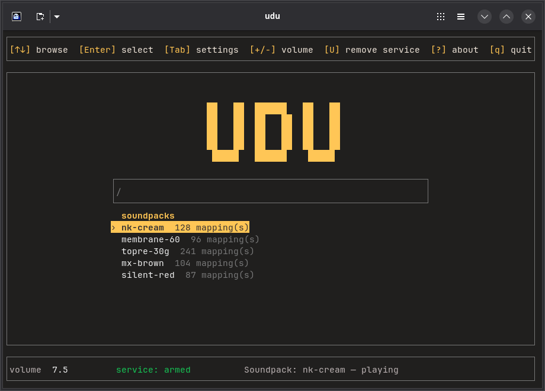

<div align="center">

# udu

**Mechanical keyboard sounds for your Linux desktop.**

[](https://github.com/smaniotov/udu/actions/workflows/ci.yml)
[](https://crates.io/crates/udu)
[](LICENSE)




</div>

Type, and your keyboard sounds like the one you wish you had. udu reads keystrokes
straight from the Linux input subsystem and plays real mechanical-switch recordings
with a low-latency audio engine — so it works the same under Wayland, X11, or a bare
TTY, without a compositor extension or a browser tab.

A small background service does the listening. The TUI drives it **live**: switching
soundpacks, keyboards, or volume never restarts audio, and closing the TUI leaves the
sound running.

---

## Install

**Prebuilt binary** — no Rust needed. Downloads the release, verifies its checksum,
installs to `~/.local/bin`. No `sudo`.

```bash
curl -fsSL https://raw.githubusercontent.com/smaniotov/udu/main/install.sh | sh
```

If piping a script into a shell makes you uneasy — reasonable, given what this program
does — download it, read it, then run it:

```bash
curl -fsSL -O https://raw.githubusercontent.com/smaniotov/udu/main/install.sh
less install.sh && sh install.sh
```

**From crates.io** — compiles locally:

```bash
cargo install udu
```

This needs Rust 1.88+ and the ALSA and D-Bus development headers:

```bash
sudo apt install libasound2-dev libdbus-1-dev pkg-config      # Debian / Ubuntu
sudo dnf install alsa-lib-devel dbus-devel pkgconf-pkg-config # Fedora
sudo pacman -S alsa-lib dbus pkgconf                          # Arch
```

**From source:**

```bash
git clone https://github.com/smaniotov/udu && cd udu
cargo build --release && ./target/release/udu
```

Linux only. The capture layer is evdev and the service is a systemd user unit, so
there is no macOS or Windows build.

## First run

Run `udu`. Two things happen:

1. **It asks before installing anything.** udu shows you the exact unit file path and
   `ExecStart` line, and installs its background service only if you say yes. Decline
   and the TUI still works — you just get no sound until you change your mind.
2. **It needs to read your keyboard.** See [permissions](#permissions) below.

Then pick a soundpack with `↑`/`↓`, hit `Enter`, and start typing.

To remove the service later, press `U` in the TUI. Arming and disarming are equally
reachable, on purpose.

## Keys

| Key | Action |
|---|---|
| `↑` `↓` | Move through the list |
| `Enter` | Activate the selected soundpack or device |
| `/` | Search soundpacks (just start typing) |
| `Tab` | Settings: general, audio, devices, about |
| `+` `-` | Volume, in steps of 5 (range 0–100) |
| `1` `2` `3` | Volume presets — Soft 30, Balanced 60, Loud 90 |
| `p` | Preview the selected pack |
| `x` | Mute — this **closes the keyboard device**, it does not just silence audio |
| `s` | Usage stats, exportable as Markdown |
| `[` `]` · `;` `'` | Tone Pad: pan the sound source, change its distance |
| `r` | Rediscover packs and devices |
| `U` | Stop and uninstall the background service |
| `?` | Help · `q` closes the TUI, service keeps running |

## Soundpacks

udu ships **no** sounds. It reads packs in the [Mechvibes](https://github.com/hainguyents13/mechvibes)
format, which the community has been building for years — drop them in
`~/.local/share/udu/soundpacks/` and press `r`.

A pack is a directory with a `config.json` whose `defines` map points key codes at
audio files (`.wav` / `.mp3`). udu validates the mapping and every referenced file
before activating a pack, so a broken pack is filtered out of the list instead of
failing halfway through your typing.

Under the hood: pack keys are [libuiohook](https://github.com/kwhat/libuiohook)
keycodes, which udu translates to evdev — including the End/PageDown pair that is
swapped in some other implementations. Every sample is peak-normalized on load so no
pack is jarringly louder than another, and a soft-knee limiter on the output bus keeps
overlapping keystrokes from clipping.

Packs are yours, not ours: whatever license their author gave them applies, and you are
responsible for the ones you install.

## Permissions

udu reads key events from the kernel, so it needs read access to your keyboard's
`/dev/input/event*` node. **Never run udu as root.**

**Recommended — a udev rule for one device.** Access to your keyboard only, for the
user at the local seat only, revoked at logout. Find the ids with `lsusb`:

```
# /etc/udev/rules.d/70-udu.rules
SUBSYSTEM=="input", KERNEL=="event*", ATTRS{idVendor}=="1234", ATTRS{idProduct}=="5678", TAG+="uaccess"
```

```bash
sudo udevadm control --reload-rules && sudo udevadm trigger   # then replug the keyboard
```

**Simpler, much broader — the `input` group:**

```bash
sudo usermod -aG input $USER   # then log out and back in
```

Know what this costs: membership in `input` grants read access to **every input device
on the machine, permanently**, to **every program you run** — not just udu. That
includes sudo prompts and password fields. It is the conventional advice and it works,
but it widens your attack surface far beyond this one app. Prefer the udev rule.

(systemd's stock `70-uaccess.rules` deliberately does not tag plain keyboards, exactly
to prevent unprivileged keylogging. That is why a per-device rule is needed rather than
nothing at all.)

## Security

udu sees every key you press. That deserves a straight answer rather than reassurance.

- **Keystrokes never leave the process.** A key is read, mapped to a sample path, and
  dropped. Nothing is logged, nothing is written to disk, nothing crosses the control
  socket.
- **Usage stats are aggregates**, counted per soundpack — not per key. Typed text
  cannot be reconstructed from them.
- **No network code exists.** There is no HTTP client anywhere in the dependency tree,
  and CI fails the build if one ever appears.
- **Mute is real.** Pressing `x` closes the input device. Check it yourself:
  `lsof /dev/input/eventN` shows nothing for udu while muted.
- **The service runs hardened** — `NoNewPrivileges`, a syscall filter, `AF_UNIX`-only,
  `MemoryDenyWriteExecute`, and more.

Full detail, including residual risks and how to verify each claim yourself, is in
[THREAT_MODEL.md](THREAT_MODEL.md). To report a vulnerability, see
[SECURITY.md](SECURITY.md) — please use private reporting, not a public issue.

Releases carry build provenance, so you can prove a binary came from this source:

```bash
gh attestation verify ~/.local/bin/udu -R smaniotov/udu
```

## How it works

```
keyboard ──evdev──▶ capture ──▶ mapping ──▶ audio engine ──▶ your speakers
                        │                       ▲
                        └── udu.service ─────────┘
                                 ▲
                          Unix socket (JSON)
                                 ▲
                               TUI
```

- `src/backend/` — evdev capture with reconnect, Mechvibes mapping, decode cache and
  voice pool, and the control socket.
- `src/service.rs` — generates and manages the systemd user unit.
- `src/app.rs`, `src/ui.rs` — the Ratatui TUI and its state.

Design decisions are recorded as ADRs in [`docs/adr/`](docs/adr/). Read the relevant
one before changing that area.

## Contributing

Issues and pull requests are welcome — please open an issue before any non-trivial PR,
so we can agree on the approach before you spend time on it. See
[CONTRIBUTING.md](CONTRIBUTING.md) for setup, the quality gates, and what is likely to
be accepted.

This is a personal project maintained by one person in their spare time. Reviews may be
slow; silence is not rejection.

## Credits

udu exists because other people solved parts of this problem first, in the open.

- **[Mechvibes](https://github.com/hainguyents13/mechvibes)** by Hai Nguyen (MIT) —
  defined the soundpack format udu reads. Every pack that works here works because
  Mechvibes established that format and a community grew around it. udu implements a
  reader for it and bundles no Mechvibes code.
- **[wayvibes](https://github.com/sahaj-b/wayvibes)** by sahaj-b — a Wayland-friendly
  keyboard sound player in C++ that reads evdev directly, and the project that showed
  this approach works on Linux without depending on a compositor. No wayvibes code is
  used: udu is an independent Rust implementation, and at the time of writing wayvibes
  declares no license, so reusing its source would not have been permissible anyway.
- **[libuiohook](https://github.com/kwhat/libuiohook)** — the keycode enumeration that
  Mechvibes packs use. udu's translation to evdev was derived from that enum and
  verified against real devices, not copied from another implementation.

Naming these is not a formality. Reading a format someone else designed, and building
on a demonstration someone else published, is most of why this was a weekend instead of
a year.

udu is an independent project, not affiliated with, endorsed by, or sponsored by any
other keyboard-sound application.

## License

MIT — see [LICENSE](LICENSE). Dependency notices are in
[THIRD-PARTY-LICENSES.md](THIRD-PARTY-LICENSES.md).

The name *ùdù* is the Igbo word for a clay pot, and the percussion instrument made
from one.
